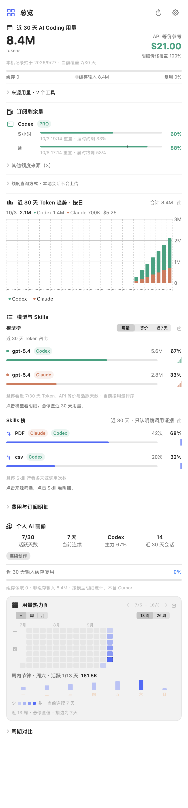

# TokenMeter for macOS

TokenMeter 是原生 macOS 菜单栏用量监控工具。汇总本机 Coding Agent 的 Token、模型与 Skills 使用情况，并提供趋势、热力图、CSV 导出和 API 等价费用参考；也支持部分平台的余额与额度查询。

需要 macOS 14 或更高。主线使用 SwiftUI、AppKit 和 Swift Charts；当前代码版本由 [swift/project.yml](swift/project.yml) 定义。

## 安装与使用

从 [GitHub Releases](https://github.com/SummerXaa-Z/tokenmeter-mac/releases) 选择对应版本，阅读该版本的签名与安装说明，下载 DMG 后将 App 拖入 `/Applications`。首次打开、配置来源和常见问题见 [用户指南](docs/user-guide.md)。

点击菜单栏图标即可进入总览。支持的本地来源包括 Claude Code、Codex、Kimi Code、OpenCode、Gemini CLI、GitHub Copilot CLI 和 Qwen Code；Cursor、DeepSeek 及部分实时额度另有账户查询边界，见 [来源覆盖与数据口径](docs/local-source-coverage.md)。

本地会话统计不会上传到 TokenMeter 服务。开启账户查询时会访问对应服务，手填凭据存入 macOS Keychain；API 等价费用是内置价格快照的估算，不能代替实际账单。

<details>
<summary>查看总览示例（合成数据）</summary>



</details>

## 项目文档

- [用户指南](docs/user-guide.md)：来源配置、统计范围、导出、数据存储与排查。
- [来源覆盖](docs/local-source-coverage.md)：本地记录、远程查询与统计限制。
- [架构说明](docs/architecture.md)：模块职责、数据流与工程配置。
- [开发指南](docs/development.md)：构建、测试、隔离 UI 验证与价格目录维护。
- [贡献说明](CONTRIBUTING.md)、[安全问题](SECURITY.md)、[发布清单](docs/release.md)、[更新记录](CHANGELOG.md)。

## 本地开发

安装 Xcode、Command Line Tools 和 XcodeGen 后，在仓库根目录执行：

```bash
brew install xcodegen
make help
make build
make release-check
```

`make release-check` 包含 XCTest、Release 编译与版本、Bundle ID、主程序元数据检查。GitHub Actions 在 PR 和 `main` 的 push 上执行同一入口；签名、公证、安装和真实账户验收另见 [发布清单](docs/release.md)。

## 历史与许可

项目原名 DeepSeek Monitor，v3 起更名为 TokenMeter，v2 起改为原生 Swift 实现。保留的 Tauri 实现见 `tauri-version` 分支与 `v1.1.0-tauri` 标签。

感谢上游 [JayHome137/DeepSeekMonitor](https://github.com/JayHome137/DeepSeekMonitor) 和 [Joyi-code/DeepSeekMonitorWindows](https://github.com/Joyi-code/DeepSeekMonitorWindows)。本项目采用 [MIT License](LICENSE)。各工具的本地格式和平台接口可能变化，支持范围以代码及对应版本说明为准。
